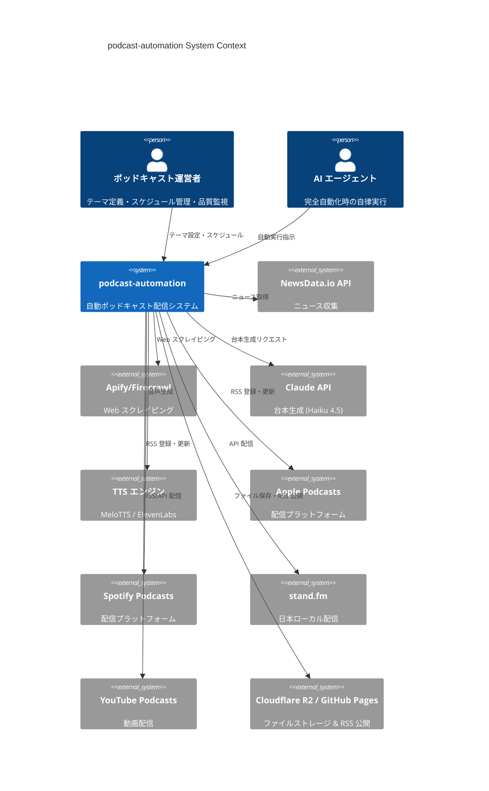
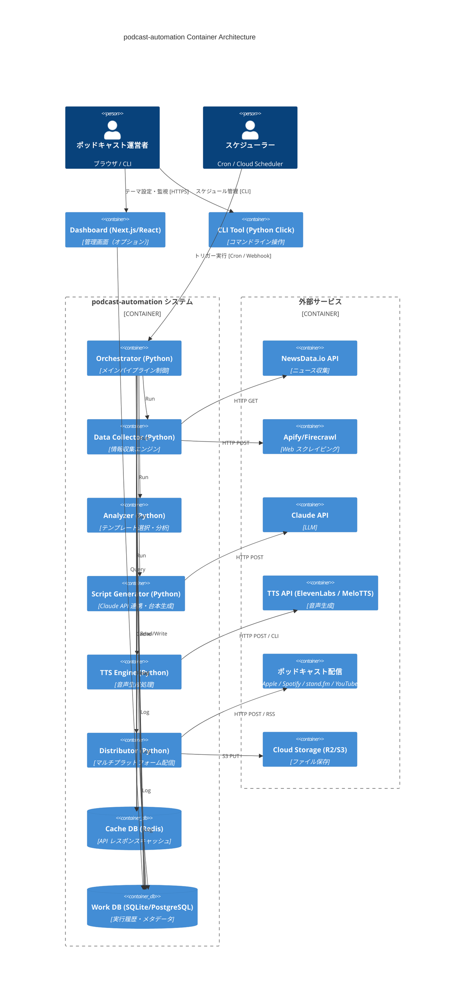
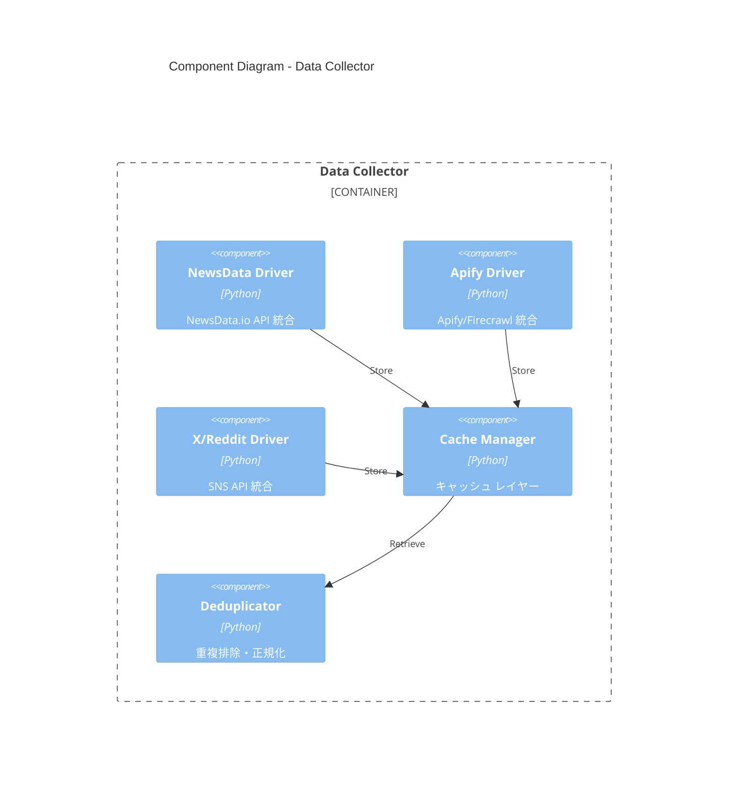
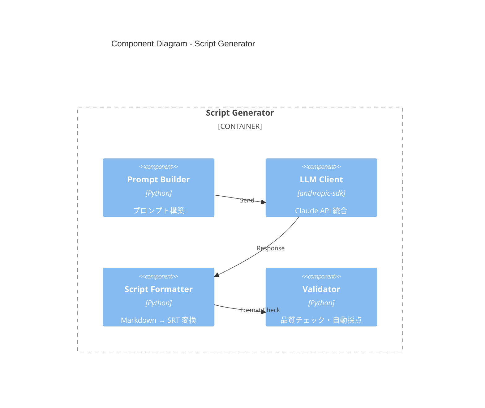
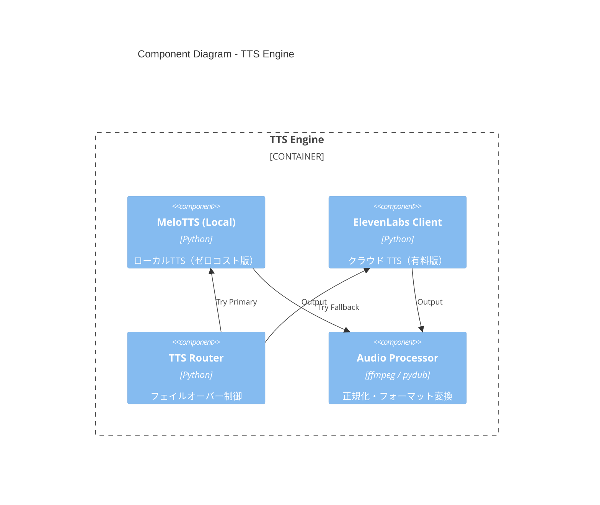
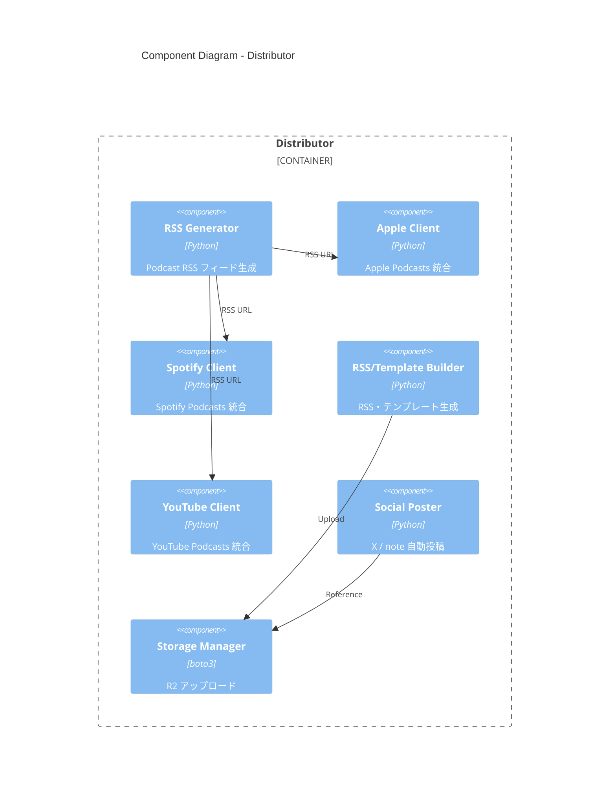
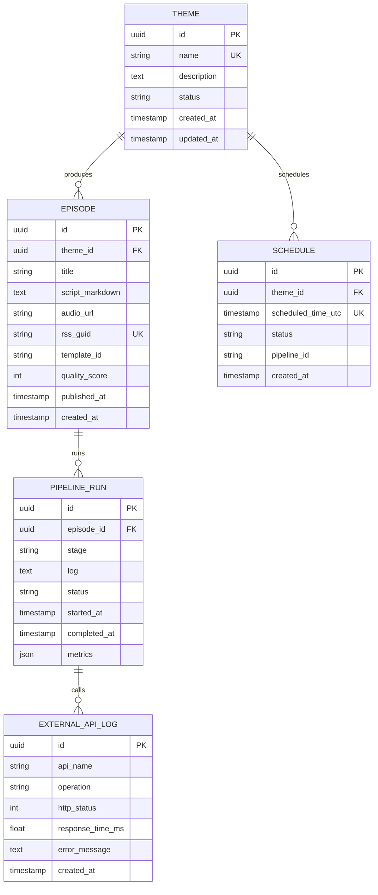

# Design: podcast-automation

> C4モデルに基づく技術設計書。
> 要件定義（requirements.md）を実装可能な設計に落とし込む。
> **対象**: 毎日3テーマのポッドキャスト自動生成・配信システム

**ステータス**: ✅ デザイン確定 → 実装準備完了

---

## 1. Context Diagram (Level 1: システムコンテキスト)

### 1.1 システム概要

- **システム名**: podcast-automation
- **目的**: ニュース/ブログ/YouTube情報を自動収集→台本生成→音声化→配信プラットフォーム自動登録
- **主要ユーザー**: ポッドキャスト運営者、AI エージェント、自動スケジューラ

### 1.2 外部アクター・システム



**主要な外部連携**:

| アクター/システム | 種別 | 役割 | 通信方式 | 依存度 |
|------------------|------|------|---------|--------|
| NewsData.io API | External Service | ニュース情報収集 | REST API | CRITICAL |
| Apify/Firecrawl | External Service | YouTube/ブログスクレイピング | REST API | HIGH |
| Claude API (Haiku) | External LLM | 台本自動生成 | REST API | CRITICAL |
| MeloTTS-Japanese | Local/External | 日本語音声生成（ゼロコスト版） | Local Command / API | HIGH |
| ElevenLabs API | External Service | プロレベル音声生成（有料版） | REST API | HIGH |
| Apple Podcasts | Distribution | メインポッドキャスト配信 | RSS + API | CRITICAL |
| Spotify Podcasts | Distribution | 主要ポッドキャスト配信 | RSS + Web Form | CRITICAL |
| stand.fm | Distribution | 日本ローカル配信 (RSS取り込み) | RSS | MEDIUM |
| YouTube Podcasts | Distribution | 動画形式配信 | RSS + Upload | MEDIUM |
| Cloudflare R2 | Storage | マルチメディアストレージ | S3-compatible API | HIGH |
| GitHub Pages | Hosting | RSS フィード公開（フォールバック） | Git Push | MEDIUM |

---

## 2. Container Diagram (Level 2: コンテナ構成)

### 2.1 全体アーキテクチャ



### 2.2 コンテナ詳細

| コンテナ | 言語 | フレームワーク | 責務 | スケーリング | デプロイ |
|---------|------|--------------|------|-------------|---------|
| **Orchestrator** | Python | APScheduler / Celery | パイプライン制御・エラーハンドリング | スケールアップ（複数スケジュール） | Server / Lambda |
| **Data Collector** | Python | aiohttp / requests | 複数API並行呼び出し・キャッシング | 並列実行（asyncio） | Server / Lambda |
| **Analyzer** | Python | pandas / scikit-learn | テンプレート選択・メタデータ抽出 | 軽量（CPU束縛） | Server / Lambda |
| **Script Generator** | Python | anthropic-sdk | Claude API 連携・プロンプト構築 | API呼び出し制限順守 | Server / Lambda |
| **TTS Engine** | Python | pydub / elevenlabs-sdk | 音声生成・正規化 | I/O束縛（外部API） | Server / Lambda |
| **Distributor** | Python | requests / boto3 | RSS 生成・マルチプラットフォーム配信 | 並列配信（ジョブキュー） | Server / Lambda |
| **Dashboard** | React/Next.js | Next.js 14+ | 管理画面（オプション） | 水平スケール | Vercel / Self-hosted |
| **CLI Tool** | Python | Click / Typer | ローカル実行・テスト用 | ローカルのみ | pip install |
| **Cache DB** | Redis | - | API キャッシュ・レート制限管理 | - | Managed Redis / Upstash |
| **Work DB** | PostgreSQL/SQLite | SQLAlchemy ORM | 実行履歴・メタデータ・監視ログ | 垂直スケール（Read Replica） | RDS / Self-hosted |

### 2.3 通信プロトコル

- **内部通信**: JSON over HTTP/gRPC （推奨: async/await + aiohttp）
- **外部API**: REST API (JSON request/response)
- **データベース**: SQL (PostgreSQL) または SQLite (軽量版)
- **ファイルストレージ**: S3-compatible API (Cloudflare R2)
- **スケジューリング**: Cron (Linux) / AWS Lambda + EventBridge / GCP Cloud Scheduler

---

## 3. Component Diagram (Level 3: 詳細コンポーネント)

### 3.1 Data Collector コンポーネント詳細



**責務分離**:
- **NewsData Driver**: NewsData.io API 仕様解析・レート制限管理
- **Apify Driver**: YouTube/ブログスクレイピング・エラーリカバリ
- **X/Reddit Driver**: トレンド取得・キーワード抽出
- **Cache Manager**: Redis 連携・TTL 管理
- **Deduplicator**: URL/コンテンツ重複排除・言語判定

### 3.2 Script Generator コンポーネント詳細



**責務分離**:
- **Prompt Builder**: テンプレート・情報・過去コンテキストからプロンプト生成
- **LLM Client**: Claude Haiku 4.5 + 3-tier fallback (Groq, Template) API呼び出し・エラーハンドリング
- **Formatter**: Markdown をメディア対応フォーマット（SRT字幕、VTT）に変換
- **Validator**: 自動品質採点（字数・敬語・重複表現・EARS準拠度）

### 3.3 TTS Engine コンポーネント詳細



**責務分離**:
- **MeloTTS (Local)**: ローカルモデル実行（transformers）、品質70-80点
- **ElevenLabs Client**: API 呼び出し（品質90-95点）、クォータ管理
- **TTS Router**: 主 / 代替 API の自動選択、フェイルオーバー
- **Audio Processor**: ビットレート正規化（128kbps）、無音削除、音量調整（-20dBFS）

### 3.4 Distributor コンポーネント詳細



**責務分離**:
- **RSS Generator**: Podcast RSS 2.0 生成、スキーマ検証
- **Apple/Spotify Client**: 認証・エピソード登録・ステータス確認
- **RSS/Template Builder**: RSS フィード生成・テンプレート組成、メタデータ自動生成
- **Social Poster**: X/note への自動クロスポスト、ハッシュタグ・リンク付加
- **Storage Manager**: Cloudflare R2 へのファイルアップロード、公開URL生成

---

## 4. API Contracts

### 4.1 内部パイプラインAPI

| エンドポイント | メソッド | 入力 | 出力 | 説明 |
|-----------|---------|------|------|------|
| `/api/v1/pipeline/trigger` | POST | `{theme, date}` | `{pipeline_id, status}` | パイプラインを手動トリガー |
| `/api/v1/pipeline/{id}/status` | GET | - | `{status, progress, current_stage}` | 実行ステータス取得 |
| `/api/v1/episodes` | GET | `?theme=philosophy&limit=10` | `{episodes: [...], meta: {...}}` | エピソード一覧取得 |
| `/api/v1/episodes/{id}` | GET | - | `{title, script, audio_url, published_at}` | エピソード詳細取得 |
| `/api/v1/episodes/{id}/regenerate` | POST | `{template_id}` | `{pipeline_id}` | エピソード再生成 |

### 4.2 管理画面API（Dashboard 連携）

| エンドポイント | メソッド | 入力 | 出力 | 説明 |
|-----------|---------|------|------|------|
| `/api/v1/themes` | GET | - | `[{id, name, description, status}]` | テーマ一覧 |
| `/api/v1/themes` | POST | `{name, keywords, description}` | `{id, created_at}` | テーマ作成 |
| `/api/v1/themes/{id}` | PUT | `{name, keywords}` | `{updated_at}` | テーマ更新 |
| `/api/v1/schedule` | GET | - | `[{date, time_utc, theme, status}]` | スケジュール一覧 |
| `/api/v1/schedule` | POST | `{theme_id, time_utc}` | `{id}` | スケジュール追加 |
| `/api/v1/metrics/dashboard` | GET | `?period=30d` | `{availability, success_rate, cost}` | ダッシュボード統計 |

### 4.3 エラーレスポンス標準

```json
{
  "success": false,
  "error": {
    "code": "API_ERROR_CODE",
    "message": "人間が読める説明",
    "details": {
      "api_name": "NewsData.io",
      "reason": "rate_limit_exceeded",
      "retry_after_seconds": 60
    }
  }
}
```

**HTTP ステータスコード**:

| ステータス | エラーコード | 説明 |
|---------|------------|------|
| 200 | SUCCESS | 正常完了 |
| 202 | ACCEPTED | 非同期処理受け入れ |
| 400 | VALIDATION_ERROR | リクエスト検証エラー |
| 401 | UNAUTHORIZED | 認証失敗 |
| 403 | FORBIDDEN | 権限エラー |
| 429 | RATE_LIMIT_EXCEEDED | API 呼び出し制限超過 |
| 500 | INTERNAL_ERROR | サーバーエラー |
| 503 | SERVICE_UNAVAILABLE | 外部サービス接続失敗 |

---

## 5. Data Model

### 5.1 主要エンティティ ER図



### 5.2 テーブル定義（PostgreSQL）

```sql
-- THEME: ポッドキャストテーマ
CREATE TABLE themes (
    id UUID PRIMARY KEY DEFAULT gen_random_uuid(),
    name VARCHAR(255) NOT NULL UNIQUE,
    description TEXT,
    status VARCHAR(20) DEFAULT 'active',
    created_at TIMESTAMP DEFAULT NOW(),
    updated_at TIMESTAMP DEFAULT NOW()
);

-- EPISODE: ポッドキャストエピソード
CREATE TABLE episodes (
    id UUID PRIMARY KEY DEFAULT gen_random_uuid(),
    theme_id UUID NOT NULL REFERENCES themes(id) ON DELETE CASCADE,
    title VARCHAR(500) NOT NULL,
    script_markdown TEXT NOT NULL,
    audio_url VARCHAR(1000),
    rss_guid VARCHAR(255) UNIQUE,
    template_id VARCHAR(50),
    quality_score INT CHECK (quality_score >= 0 AND quality_score <= 100),
    published_at TIMESTAMP,
    created_at TIMESTAMP DEFAULT NOW(),
    CONSTRAINT episode_theme_date_unique UNIQUE (theme_id, published_at)
);

-- SCHEDULE: 配信スケジュール
CREATE TABLE schedules (
    id UUID PRIMARY KEY DEFAULT gen_random_uuid(),
    theme_id UUID NOT NULL REFERENCES themes(id) ON DELETE CASCADE,
    scheduled_time_utc TIMESTAMP NOT NULL,
    status VARCHAR(20) DEFAULT 'pending',
    pipeline_id VARCHAR(255),
    created_at TIMESTAMP DEFAULT NOW(),
    CONSTRAINT schedule_unique UNIQUE (theme_id, scheduled_time_utc)
);
CREATE INDEX idx_schedule_status ON schedules(status);
CREATE INDEX idx_schedule_time ON schedules(scheduled_time_utc);

-- PIPELINE_RUN: パイプライン実行履歴
CREATE TABLE pipeline_runs (
    id UUID PRIMARY KEY DEFAULT gen_random_uuid(),
    episode_id UUID REFERENCES episodes(id) ON DELETE CASCADE,
    stage VARCHAR(50),
    log TEXT,
    status VARCHAR(20),
    started_at TIMESTAMP DEFAULT NOW(),
    completed_at TIMESTAMP,
    metrics JSONB DEFAULT '{}'::jsonb
);
CREATE INDEX idx_pipeline_status ON pipeline_runs(status);
```

### 5.3 キャッシュスキーマ（Redis）

```
Key Format: cache:{api}:{resource}:{hash}
Examples:
  - cache:newsdata:philosophy:{date_hash} → JSON
  - cache:youtube:trending:jp → JSON array
  - cache:episode:{template_id} → Cached script

Expiry:
  - News: 6 hours
  - YouTube: 12 hours
  - API responses: 1 hour
  - Generated scripts: 7 days
```

---

## 6. Security Design

### 6.1 認証・認可

- **管理画面**: OAuth2.0 + OIDC (Google / GitHub) + MFA（Google Authenticator）
- **API エンドポイント**: JWT トークン（有効期間: 1 hour、Refresh: 7 days）
- **外部API キー**: AWS Secrets Manager / HashiCorp Vault で暗号化管理

### 6.2 データ保護

- **通信**: TLS 1.2以上（すべてのHTTP通信）
- **保存時暗号化**: AES-256 (SQLite/RDS)
- **PII マスキング**: ログに個人情報・APIキーを含めない（自動マスク）
- **監査ログ**: すべての設定変更・エピソード削除を audit.log に記録

### 6.3 STRIDE脅威分析

| 脅威 | シナリオ | 緩和策 |
|-----|---------|--------|
| **Spoofing** | 不正な API キーで操作 | OAuth2 + JWT 署名検証 |
| **Tampering** | 配信中のファイル改ざん | TLS + ファイルハッシュ検証 |
| **Repudiation** | 削除を否定 | 監査ログ（改ざん防止） |
| **Information Disclosure** | APIキーログ露出 | 自動マスキング + Vault 利用 |
| **Denial of Service** | API 呼び出し枯渇 | Rate limiting + キャッシング |
| **Elevation of Privilege** | ユーザー → Admin 昇格 | RBAC + JWT scope 検証 |

---

## 7. Non-Functional Design

### 7.1 パフォーマンス

**実行時間 SLO**:
- P50: <90分
- P95: <120分
- P99: <150分

**リソース配分**:
- 情報収集: 10分（並列化で削減）
- 台本生成: 3～5分（Claude API）
- 音声生成: 5～15分（TTS エンジン依存）
- 配信: 2～3分（マルチプラットフォーム並列）

### 7.2 スケーラビリティ

**初期 (3 テーマ)**:
- API 呼び出し: ~30,000/月
- ストレージ: ~15GB/月
- 計算: ~100 GPU時間/月

**中期 (10 テーマ × 複数言語)**:
- API 呼び出し: ~300,000/月
- ストレージ: ~150GB/月
- 計算: ~500 GPU時間/月

**スケーリング戦略**:
- データ収集: 非同期並列化（asyncio）
- 音声生成: ジョブキュー（Celery / AWS SQS）
- 配信: マルチスレッド（ThreadPoolExecutor）

### 7.3 可用性

**SLO**: 月間 99.0% (ダウン時間 <4.3時間)

**対策**:
- API フェイルオーバー: NewsData → キャッシュ → Apify
- TTS フェイルオーバー: ElevenLabs → MeloTTS → キャッシュ
- ディストリビューション リトライ: 指数バックオフ（最大3回）

### 7.4 監視・ロギング

**メトリクス**:
- API 成功率 (≥95%)
- パイプライン実行時間 (P95 <120分)
- 音声生成成功率 (=100%)
- ストレージ使用量

**ログレベル**:
- ERROR: API失敗、フェイルオーバー、スキップ
- WARN: SLO違反、レート制限接近
- INFO: パイプライン進捗（段階ごと）
- DEBUG: API リクエスト/レスポンス（開発環境のみ）

**ダッシュボード**: Grafana / CloudWatch / Datadog で real-time 監視

---

## 8. デプロイメント・運用設計

### 8.1 実行環境オプション

| 環境 | リソース | 初期設定 | 月額コスト | 推奨用途 |
|------|---------|---------|-----------|---------|
| **ローカル Mac/Linux** | 自身の PC | cron + git | ¥0 | 開発・テスト・初期運用 |
| **VPS (Linode/DigitalOcean)** | 2GB RAM / 50GB SSD | Docker + systemd | ¥500-2,000 | 小規模運用（月100エピソード） |
| **AWS Lambda** | Serverless | SAM / Terraform | ¥2,000-5,000 | スケール運用 |
| **Google Cloud Run** | Serverless | Cloud Scheduler | ¥1,500-4,000 | 高可用性要求環境 |

### 8.2 CI/CD パイプライン

```
GitHub → Actions:
  1. Lint (black, flake8)
  2. Unit Tests (pytest, 80%+ coverage)
  3. Integration Tests (Docker Compose)
  4. Security Scan (bandit)
  5. Deploy to Staging
  6. Smoke Tests
  7. Approve → Deploy to Production
```

### 8.3 バージョン管理・リリース

- **リリース頻度**: 月1回（Feature release）+ 必要に応じてホットフィックス
- **バージョニング**: Semantic Versioning (v1.0.0)
- **変更ログ**: CHANGELOG.md で全変更を記録

---

## 9. 実装ロードマップ

### Phase 1: MVP (Week 1-8)
- ✅ Requirements 定義完了
- 📋 Design 完了（このドキュメント）
- 🔨 Collector + Analyzer + Generator の実装
- 🔨 MeloTTS (ローカルTTS) 統合
- 🔨 Apple Podcasts + Spotify RSS 配信
- 🧪 ユニットテスト + 統合テスト
- 📦 VPS 上での初期運用テスト

### Phase 2: 拡張 (Week 9-16)
- 🔨 ElevenLabs (有料TTS) 統合
- 🔨 RSS・テンプレート生成・YouTube API 統合
- 🔨 Dashboard (React) 実装
- 🔨 高度なテンプレート機械学習
- 🔨 複数言語対応（英語・中国語）

### Phase 3: 最適化 (Week 17+)
- 🔨 AWS Lambda / Cloud Run への移行
- 🔨 AI エージェント化（自動判断・スケーリング）
- 🔨 アナリティクス・リスナー分析
- 🔨 マネタイズ機能（スポンサー・プレミアム）

---

**ステータス**: ✅ デザイン確定

次のステップ: ADR 記録 → 実装開始

